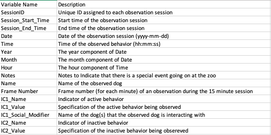
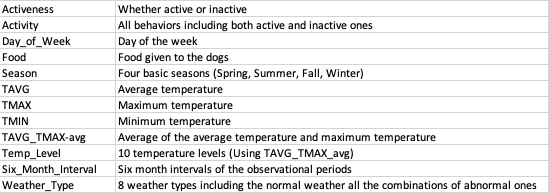

```{r setup, include=FALSE}
knitr::opts_chunk$set(echo = FALSE, message = FALSE)
```

```{r Loading Libraries}
library(readr)
library(dplyr)
library(tidyr)
library(stringr)
library(magrittr)
library(ggplot2)
library(lubridate)
library(gridExtra)
library(grid)
library(formattable) #To make a nice table
library(zoo)
library(tibble)
library(ggbeeswarm)
```


```{r Source}
source("cleaning.R")
source("columns_addition.R")
```

\

#### **Goals**

1. **Explore potential associations between the dogs’ behavior and external factors such as weather, temperature, events and food**
    + Measured by the creation of multiple visualizations
2. **Inform the client about the data cleaning procedure**
    + Measured by the creation of an R markdown file to send to the client
3. **Fulfill the client’s request to create/modify new or existing visualizations**
    + Measured by the creation of an updated Figure 1 based on 6-month intervals and the creation of a bar plot that displays the distribution of observations based on the day of week/time of day
4. **Investigate the possibility of creating the requested program** 
    + Measured by the ability to articulate the pros, cons, and alternative means

\

#### **Meeting with the Client**


\

##### **Questions**  
  + Level of technology and whether they want to use R (data cleaning procedure report)
  + Format of the instruction document (Google Docs or R markdown)  
  + Expectation for the program (Visuals etc. )  
  + How many/which animals in the program?  
  + Data structure consistency  
  + Data storage    

\

##### **Answers**  
  + Unfamiliar with the data analysis tools/technologies beyond Excel  
    + Willing to adopt R as a way to clean data in the future  
  + R markdown with both codes and an instruction  
  + Three plots that we created:  
    + Active vs. Inactive proportion throughout the week  
    + Behavior frequencies throughout the day  
    + Proportion of the inactive behaviors  
  + Ideally all animals (45 species)  
  + The data structure is fundamentally the same
    + There could be more columns depending on the animal's activeness
  + ZooMonitor (not too troublesome to transfer the data to Google Drive)

\


#### **Data**
##### **Cleaning** (recap)  
Cleaned through the shared cleaning script (Only the basic cleaning procedure)

**Data Dictionary as of two weeks ago** 



\

##### **Column Additions**  

Column additions script (six column additions at once)  

**Data Dictionary as of now** 



\

##### **Food**

* Created a food column for the data set
* A relabeling of the day of week column
* Used to create visuals associated with Goal 1

\

##### **Weather/Temperature Data**
Data obtained from *NOAA*

  + Recorded at the Pueblo Airport, which is 15 min away from the zoo
  
  + Main variables: date, average/max/min temperature, and (abnormal) weather types
  
  + Limits  
    + Absence of the normal weathers such as sunny and rainy 
    + A good portion of observed days had missing entries in  those weather types, and some days had multiple weather types simultaneously  
    + Temperature of the recorded time didn't make sense    


#### **Goal 1**

\


\


##### **Visual for Food**

```{r Visual for Food (Including Saturday), fig.width = 15, fig.height = 11}
################## Association B/W Food and Dog Behavior (Including Saturday)

#Vector for relabeling barplots
behavior_order <- c("Dog Int","Eating","Object Int", 
                    "Running", "Walking", "Alert", "Other", 
                    "Out of View", "Resting", "Sleeping")

#Vector for coloring labels
label_coloring <- rep(c("forestgreen","maroon"), times = c(5,5))

#Ground Meat (Including Saturday)
ground_meat <- ggplot(data = dogs_data %>% filter(Food == "Ground Meat"), aes(x = Activity)) + 
  geom_bar(aes(y = ..count..), fill = "steelblue") +
  labs(title = "Bar Plot of Dog Behavior (Per Hour of Day)", subtitle  = "Food: Ground Meat"
       , y = "Frequency") + facet_grid(. ~ Hour) +
  theme(axis.text.x = element_text(angle = 90, color = label_coloring)) +
  scale_x_discrete(limits = behavior_order) 
 

#Bones
bones <- ggplot(data = dogs_data %>% filter(Food == "Bones"), aes(x = Activity)) + 
  geom_bar(aes(y = ..count..), fill = "steelblue2", width = .55) +
  labs(title = "Bar Plot of Dog Behavior (Per Hour of Day)", subtitle  = "Food: Bones"
       , y = "Frequency") + facet_grid(. ~ Hour) +
  theme(axis.text.x = element_text(angle = 90, color = label_coloring)) +
  scale_y_continuous(limits = c(0,500)) +
  scale_x_discrete(limits = behavior_order) 


#Plotting Food Graph (Including Saturday)
grid.arrange(ground_meat, bones, nrow = 2)

```

\

```{r Visual for Food (Not Including Saturday), fig.width = 15, fig.height = 11}
################### Association B/W Food and Dog Behavior (NOT Including Saturday)


#Ground Meat (NOT Including Saturday)
ground_meat_nosat <- ggplot(data = dogs_data %>% filter(Food == "Ground Meat", Day_of_Week != "Sat"), aes(x = Activity)) + 
  geom_bar(aes(y = ..count..), fill = "steelblue") +
  labs(title = "Bar Plot of Dog Behavior (Per Hour of Day)" 
       , subtitle  = "Food: Ground Meat (Excluding Saturdays)"
       , y = "Frequency") + facet_grid(. ~ Hour) +
  theme(axis.text.x = element_text(angle = 90, color = label_coloring)) +
  scale_y_continuous(limits = c(0,200)) + 
  scale_x_discrete(limits = behavior_order) 
 

#Bones
bones_nosat <- ggplot(data = dogs_data %>% filter(Food == "Bones"), aes(x = Activity)) + 
  geom_bar(aes(y = ..count..), fill = "steelblue2", width = .65) +
  labs(title = "Bar Plot of Dog Behavior (Per Hour of Day)", subtitle  = "Food: Bones"
       , y = "Frequency") + facet_grid(. ~ Hour) +
  theme(axis.text.x = element_text(angle = 90, color = label_coloring)) +
  scale_y_continuous(limits = c(0,200)) +
  scale_x_discrete(limits = behavior_order) 


#Plotting Food Graph (NOT Including Saturday)
grid.arrange(ground_meat_nosat, bones_nosat, nrow = 2)


```


* Dogs were fed different types of food throughout the week
    + Ground Meat: Monday/Tuesday/Thursday/Saturday (n = 2484)
    + Bones: Wednesday/Sunday (n = 681)  
    
* Controlled for the time of day by faceting
* Second plot omits observations all Saturday observations (n = 811 for Ground Meat)
    + A LOT of resting observations on Saturday mornings
* Less activity in the morning on bone days 
* No major differences besides 1PM and 2PM

\

#### **Goal 2**

Data Cleaning Report for Pueblo Zoo

\

#### **Goal 3**

\

\

##### **Figure 2.**

```{r Percentage of Observations based on Day of Week/Time of Day, fig.height = 6, fig.width = 10}
time_of_day_viz <- ggplot(data = dogs_data, aes(x = Hour)) + 
  geom_bar(aes(y = ..count../nrow(dogs_data)*100), fill = "steelblue", width = .75) + 
  scale_x_discrete(limits = 9:16) +
  scale_y_continuous(limits = c(0,25)) + 
  geom_hline(yintercept = (1/8)*100, color = "darkmagenta", alpha = .45, linetype = "longdash") +
  labs(title = "b. Percentage of Observations (Per Time of Day)", x = "Time of Day", y = "Percentage (%)") +
  annotate("text", x= 16.6, y = 13.5 , label = "12.5%", color = "darkmagenta", size = 3.25) +
  theme(plot.title = element_text(size = 11))

day_of_week_viz <- ggplot(data = dogs_data, aes(x = Day_of_Week)) +
  geom_bar(aes(y = ..count../nrow(dogs_data)*100), fill = "steelblue2", width = .75) +
  scale_x_discrete(limits=c("Mon", "Tue", "Wed", "Thu", "Fri", "Sat", "Sun")) +
  scale_y_continuous(limits = c(0,60)) +
  labs(title = "a. Percentage of Observations (Per Day of Week)", x = "Day of Week", y = "Percentage (%)") +
  geom_hline(yintercept = (1/7)*100, color = "darkmagenta", alpha = .45, linetype = "longdash") +   annotate("text", x= 1.5, y = 16.5 , label = "14.28%", color = "darkmagenta", size = 3.25) +
  theme(plot.title = element_text(size = 11))
  

grid.arrange(day_of_week_viz, time_of_day_viz,  nrow = 1)

```


* Unequal representation of certain days and times of the day
* Horizontal line represents percentage of observations under equal representation
* Day of Week Plot
    + Most observations on Saturdays (Over 50%)
    + Least observations on Fridays
* Time of Day Plot
    + More observations recorded at 9AM, 10AM and 2PM 
    + Less observations recorded at 12PM and 4PM

\


#### **Goal 4**


\

\

\


#### **Progress Reflection**

\

\

\

#### **Goal Reflection**

1. Explore associations between dogs’ behavior and external factors $\rightarrow$ Complete
    + We created visualizations for four different external factors
2. Inform the client about the data cleaning procedure $\rightarrow$ Complete
    + We created and sent a comprehensive document to the client
3. Fulfill the client’s request to create/modify new or existing visualizations $\rightarrow$ Complete
    + Created two plots illustrating:
        + The frequency of inactive behaviors in 6 month intervals
        + The percentage of observations per day of week, and time of day
    + We sent the client a progress report which includes these visuals
4. Investigate the possibility of creating the requested program  $\rightarrow$ Complete
    + We researched the pros and cons of potential tools and presented the findings 


* Feasible, but was a much heavier load than the previous debriefing
* Some goals were time consuming, others not as much
* Efficient distribution of various tasks helped us meet all of our goals

\

#### **Next Steps**

\

\

\


