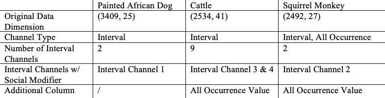

```{r setup, include=FALSE}
knitr::opts_chunk$set(echo = FALSE, message = FALSE)
```

```{r Loading Libraries}
library(readr)
library(dplyr)
library(tidyr)
library(stringr)
library(magrittr)
library(ggplot2)
library(lubridate)
library(gridExtra)
library(grid)
library(formattable)
library(zoo)
library(tibble)
library(forcats)
```


```{r Source}
source("Cleaning and Addition Scripts/dogs_cleaning.R")
source("Cleaning and Addition Scripts/cattle_cleaning.R")
source("Cleaning and Addition Scripts/sq_monkey_cleaning.R")
source("Cleaning and Addition Scripts/dogs_columns_addition.R")
source("Cleaning and Addition Scripts/cattle_columns_addition.R")
source("Cleaning and Addition Scripts/sq_monkey_columns_addition.R")
```

\

### **Goals**

1. **Work with the Cattle data and answer the client's questions regarding the animal**
    + Measured by the creation of visualizations to send to the client
    
2. **Work with the Squirrel Monkey data and answer the client’s questions regarding the animal**
    + Measured by the creation of visualizations to send to the client
    
3. **Explore the differences in the structure of the animal datasets that we currently have.**
    + ~~Measured by the ability to articulate the differences during the next debriefing~~
    + Measured by the creation of a table accompanied by bullet point comments, both detailing the various differences 
    
4. **Create a prototype R Shiny program for only the Painted African Dogs, Cattles, and Squirrel Monkeys** 
    + ~~Measured by a live demonstration during the next debriefing~~
    + Measured by the posting of a link for people to test out the prototype R Shiny Program


* We worked on the four goals listed above for Debriefing #3
* For Goal 3 and Goal 4, we made slight modifications on how our progress can be measured, as debriefings are now deilivered in a written format


***

### **Meeting with the Client**
We had our 3rd meeting with Anna on 3/18/2020 (Wednesday) to show some visuals and to interview her about the program.

\

#### **Plots** 

* We showed her the plots and tables we had created to answer her questions about Cattles and Squirrel Monkeys
* We also showed her the plots related to Painted African Dogs 
    + Some of these plots were the ones already presented in our last debriefing
    + Some additional plots were not part of our goals this time, but created nevertheless for our client
* This part of the meeting was mainly about talking through some of the plots with the client

\

#### **Program** 
* We then asked her about her expectations for our final product, a program that will show some plots/information, addressing all species
* Even though we had asked similar things before, we had only shown her some general plots back then 
* Since we had created a wider variety of plots by our last meeting, we were curious if she had new ideas in mind what to put into the program. 

* Last time, she requested the three plots that we sent her during the first meeting (2/6/2020) to be in the program:
  + Behaviors throught the day (Frequency & Proportion)
  + Activeness throught the week (Frequency)
  + Proportion of the behavior "Others" within all inactive behaviors

* We suggested that we create various inputs in the program so that the user can choose a factor by which they facet the data, e.g., day of week, time of day, animal's name, etc.
* She agreed on this suggestion and requested that we incorporate some more detailed plots into the program, e.g., distribution of their observations, shift in animals' behaviors after a certain event, etc.

\

#### **Post Meeting**  

* Based on our client's requests, we finalized the plots and choices of inputs we put in the prototype program:
  + Barplots illustrating the distribution of observations (by hour of day/day of week/animal name)
  + Barplots of user selected Behaviors (y axis: percentage/x-axis: individual animals) and accompanying tables
  + Barplots of user selected Categories (y axis: percentage/x-axis: individual animals) and accompanying tables
  + Pie chart of Behaviors before/after a certain event, e.g., death of the baby JT (in the Painted African Dogs' case)
  + Barplot of Behaviors by hour of day and day of week, for all individual animals or just a specific name
  
*Category is a variable that groups similar behaviors together*
  
***

### **Goal 1**

***Visuals for Cattles***

\

#### **Agonistic Behaviors**
*How often are they showing Agonistic behaviors?*

```{r visual/table for Cattle agonistic behaviors, fig.width = 6, fig.height = 4}
cattle_agonistic <- cattle_data %>% filter(Category == "Agonistic") %>%
  select(Name, IC4_Social_Modifier, Activity, Date, Time) %>%
  mutate(Time = str_sub(Time, 1,5))

ggplot(cattle_agonistic, aes(x=Name, fill=IC4_Social_Modifier)) +
  geom_bar(position = "stack", width = 0.4) +
  labs(title = "Cattle showing agonistic behaviors", x = "Animal Name", y = "Frequency of agonistic behaviors", fill = "Towards") + 
  scale_fill_manual(values = c("coral","cornflowerblue", "darkolivegreen3")) +
  theme(plot.title = element_text(size = 12, face = "bold"),
        plot.subtitle = element_text(size = 9, face = "italic"),
        legend.title = element_text(size = 10),
        legend.text = element_text(size = 8))

colnames(cattle_agonistic)[1] <- 'Cattle showing agonistic behavior'
colnames(cattle_agonistic)[2] <- 'Towards'

cattle_agonistic$Date <- format(cattle_agonistic$Date, format = "%B %d, %Y")

formattable(cattle_agonistic, align = c("l", rep("c",3)))
```


The visual displays how often each cattle shows agonistic behavior, while the table details the type of agonistic behavior and gives more insight about what happened during a conflict.


* **Visual:**
    + Batik and Chilly Jane often show agonistic behaviors towards each other.
    + Patty sometimes shows agonistic behaviors towards Batik and Chilly Jane.
* **Table:**
    + 2019/05/26: Patty displays threat to the other two.
    + 2019/07/18: Batik and Chilly Jane are aggressive towards one another -- a conflict between the two.
    + 2019/07/21: Patty displays threat to Chilly Jane, Batik and Chilly Jane are aggressive towards each other -- a conflict between all three.
    + 2019/08/02, 2019/08/20, 2019/09/19: conflicts between Batik and Chilly Jane.

\

#### **Stereotypic Behaviors**
*How often are they showing Stereoptypic behaviors?*

```{r Table for Stereotypic Behaviors}

cattle_stereotypic <- cattle_data %>% filter(Category == "Stereotypic") %>%
  select(Name, Activity, Date, Time) %>%
  mutate(Time = str_sub(Time, 1,5))

cattle_stereotypic$Date <- format(cattle_stereotypic$Date, format = "%B %d, %Y")
  

formattable(cattle_stereotypic, align = c("l", rep("c",3)))

```


* Since there were only five observations in the data set where a cattle showed stereotypic behaviors, we decided to create just a table instead of a visualization
* The table depicts the name of the cattle showing the stereotypic behavior, the type of stereotypic behavior, as well as the date and time of when the behavior occured 
* With only five cases, it appears as though cattles showing stereotypic behaviors is very rare 
* Also, of the three cattles at the zoo, only two of them were observed showing stereotypic behaviors


\

#### **Active vs. Inactive Behaviors**
*Are they spending more of their day active or inactive?*


```{r Visual for Cattle Active vs. Inactive for individual cattles}
##Common procedure
cattle_data$Hour <- as.numeric(cattle_data$Hour)
cattle_data$Category <- factor(cattle_data$Category, levels = c("Agonistic","Enrichment-based",
                                                                "Exploratory & Feeding", 
                                                                "Locomotion", "Maintenance", 
                                                                "Social", "Stereotypic", 
                                                                "Inactive", "Other"))
label_coloring <- rep(c("forestgreen","maroon"), times = c(7,2))

##plots ffor indivdual
cattle_data_grouped <- group_by(cattle_data, Name, Hour, Category)
summary <- as.data.frame(summarise(cattle_data_grouped, n()))
names(summary)[names(summary) == "n()"] <- "counts"
summary <- summary %>% group_by(Name, Hour) %>%
  mutate(sum = sum(counts))
cattle_data_HR <- left_join(cattle_data, summary, by = c("Name", "Hour", "Category"))
cattle_data_HR <- mutate(cattle_data_HR, percent = cattle_data_HR$counts/cattle_data_HR$sum*100)
cattle_data_HR$percent <- round(cattle_data_HR$percent, digits = 1)
cattle_data_HR$percent <- paste(cattle_data_HR$percent, "%")
##Plots of category by cattle by hour by name
#similar distribution
ggplot(cattle_data_HR, aes(x = Category, y = counts)) + 
  geom_bar(stat="identity", position=position_dodge(), fill = "salmon") +
  theme(axis.title.x = element_blank()) + 
  labs(title = "Bar Plot of Cattle's Behavior Category", subtitle = "Individuals", y="Counts") +
  facet_grid(Name ~ Hour) +
  theme(axis.text.x = element_text(angle = 90, color = label_coloring),
        plot.title = element_text(size = 12, face = "bold"),
        plot.subtitle = element_text(size = 9, face = "italic"))


```

```{r Visual for Cattle Active vs. Inactive for all cattles}
cattle_data_grouped2 <- group_by(cattle_data, Hour, Category)
summary2 <- as.data.frame(summarise(cattle_data_grouped2, n()))
names(summary2)[names(summary2) == "n()"] <- "counts"
summary2 <- summary2 %>% group_by(Hour) %>%
  mutate(sum = sum(counts))
cattle_data_HR2 <- left_join(cattle_data, summary2, by = c("Hour", "Category"))
cattle_data_HR2 <- mutate(cattle_data_HR2, percent = cattle_data_HR2$counts/cattle_data_HR2$sum*100)
cattle_data_HR2$percent <- round(cattle_data_HR2$percent, digits = 1)
cattle_data_HR2$percent <- paste(cattle_data_HR2$percent, "%")
ggplot(cattle_data_HR2, aes(x = Category, y = counts)) + 
  geom_bar(stat="identity", position=position_dodge(), fill = "salmon") +
  labs(x = "Behavior Category", subtitle = "General", y="Counts") +
  facet_grid(. ~ Hour) +
  theme(axis.text.x = element_text(angle = 90, color = label_coloring),
        plot.title = element_text(size = 12, face = "bold"),
        plot.subtitle = element_text(size = 9, face = "italic"))
```

*Green = Active, Red = Inactive*


* Cattles generally spend more actively around 10am and 11am and more inactively after lunch time
* All three cattles behave similarly throuout the day
* It is likely that the zoo keepers normally feed the animals around 11am since the "Exploratory & Feeding" bar is the highest around that time
* There are substantially fewer observations at 12pm and 4pm, analogous to the Painted African Dogs' case


\

#### **Positive Behaviors**
*Is there one animal that spends more time doing the positive behaviors (Enrichment-based, Maintenance, Social, Locomotion)?*

```{r (CATTLE) Positive Behavior Visual}

#Creating Data Frame for Positive Behavior Visual
cattle_positive <- cattle_data %>% filter(Behavior_Type == "Positive") %>%
  group_by(Name, Category) %>% 
  summarize(Count = n()) 

cattle_positive <- cattle_positive %>% cbind(Percentages = cattle_positive$Count / rep(c(720, 761, 692), times = c(4,4,4)))

#Positive Behavior Visual
ggplot(data = cattle_positive) +
  geom_bar(aes(x = Name, y = Percentages, fill = Category), stat = "identity", width = .4) +
  labs(title = "Barplot of Positive Behaviors per Cattle",
       subtitle = "Percentages based on each cattle's total number of observations",
       x = "Cattle", y = "Percentage") +
  theme(plot.title = element_text(size = 12, face = "bold"),
        plot.subtitle = element_text(size = 9, face = "italic"),
        legend.title = element_text(size = 10),
        legend.text = element_text(size = 8)) +
  scale_y_continuous(labels = scales::percent_format(accuracy = 1L), 
                     limits = c(0,.4)) +
  scale_fill_manual(values = c("deeppink1", "springgreen3", "cyan2", "gold3")) 
  

```

* The visualization illustrates the percentage of times each cattle was observed doing a positive behavior
  + The percentages for each cattle are based on the total number of observations for that specific cattle
  + For example, considering **only** Batik's observations, roughly 36% of those observations are of a positive behavior

* The visualization suggests that Batik spends the most time doing positive behaviors, followed by Patty, and then Chilly Jane
* The coloring indicates that the composition that makes up the total percentage of positive behaviors differs for each cattle
  + Chilly Jane spends a lot more time doing locomotion behaviors than maintanance behaviors
  + Patty spends a lot more time doing maintanence behaviors than locomotion behaviors
 
***


### **Goal 2**

***Visuals for Squirrel Monkeys***

\

#### **Aggressive Behaviors**
*Is it one squirrel monkey being aggressive to all the others or is it one being picked on regularly?*

```{r visual/table for Monkey aggressive behaviors, fig.width = 6, fig.height = 4}
monkey_aggression <- sq_monkey_data %>% filter(Activity == "Aggression") %>%
  select(Name, AOV_Social_Modifier, Date, Time) %>%
  mutate(Time = str_sub(Time, 1, 5))

ggplot(monkey_aggression, aes(x=Name, fill=AOV_Social_Modifier)) +
  geom_bar(position = "stack", width = 0.4) +
  labs(title = "Monkeys showing aggressive behaviors", x = "Animal Name", y = "Frequency of aggressive behaviors", fill = "Towards") + 
  scale_fill_manual(values = c("coral","cornflowerblue", "darkolivegreen3","darkorchid1", "darkcyan")) +
  theme(plot.title = element_text(size = 12, face = "bold"),
        plot.subtitle = element_text(size = 9, face = "italic"),
        legend.title = element_text(size = 10),
        legend.text = element_text(size = 8))
 

colnames(monkey_aggression)[1] <- 'Monkey showing aggressive behavior'
colnames(monkey_aggression)[2] <- 'Towards'

monkey_aggression$Date <- format(monkey_aggression$Date, format = "%B %d, %Y")

formattable(monkey_aggression, align = c("l", rep("c",3)))
```

* **Visual:**
    + Isabel showed significantly more aggressive behaviors than other monkeys.
    + Again, the visual displays how often each monkey shows aggressive behaviors, while the table gives more insight about what happened on a particularly day.
* **Table:**
    + 2017/11/06: Damian was aggressive towards Brazil; Pistacio was aggressive towards both Brazil and Filbert. There was probably a conflict between all four monkeys (Squirt has not come to the zoo yet at this point).
    + 2017/12/19, 2018/02/01, 2018/02/22: Isabel showed aggressive behaviors towards Brazil, Damian and Filbert respectively.
    + 2018/03/12: Isabel showed aggressive behaviors towards Pistacio, who is aggressive towards Filbert. There might have been a conflict between the three.
    + 2019/02/17: Both Isabel and Brazil were aggressive towards Filbert.
    + 2020/02/08: Filbert was aggressive towards Squirt.


* Isabel is constantly involved in conflicts and is showing aggressive behaviors to almost all other monkeys.
* Filbert is also constantly involved in conflicts and is often the one being picked on.

\

#### **Head Spins**
*Which animal is doing head spins and how often?*

```{r (MONKEY) Head spins Visual }

#Vector of total number of observations for each monkey

obs_per_monkey <- c(638,234,594,620,256,178)

#Barplot of Headspins (Percentage + Count)
ggplot(data = sq_monkey_data %>% filter(Activity == "Head spin")) +
  geom_bar(aes(x = Name, y= ..count.. / obs_per_monkey), fill = "turquoise3", width = .6) +
  labs(title = "Barplot of Head Spins per Monkey", 
       subtitle = "Percentages based on each monkey's total number of observations",
       x = "Monkey", y = "Percentage") +
  theme(plot.title = element_text(size = 12, face = "bold"),
        plot.subtitle = element_text(size = 9, face = "italic")) +
  scale_y_continuous(labels = scales::percent_format(accuracy = 1L), 
                     limits = c(0,.125)) +
  geom_text(aes(x = Name, y = ..count.. / obs_per_monkey, label = ..count..), 
            stat = "count", vjust = -.4, size = 3.5, fontface = "italic")
```


* The visualization depicts the percentage of times each squirrel monkey was observed doing a head spin
  + The percentages for each monkey are based on the total number of observations for that specific monkey
  + For example, considering **only** Damian's observations, a little over 4% of those observations are of him doing a head spin. 
  
* The numbers on top of each bar represent the raw count of the number of head spins a particular animal was observed doing
  + Even though Filbert had 30 head spin observations while Damain only had 10, the percentage of head spin observations relative to their total number of observations is similar

* Notably, Brazil is observed doing a head spin on a more regular basis than the other monkeys. Roughly 11% of all her observations are of her doing a head spin
* Isabel and Squirt are the monkeys that were observed doing a head spin the least often in percentage terms

\

#### **Impact of Events on Behavior**
*Did the deaths of Damian and Pistacio have an impact on the monkeys' behavior?*

*Did the addition of Squirt have an impact on the monkeys' behavior?*

\

##### **Damian's Death**

\

```{r Visual for before and after the death of Damian}

#########Damian's death with Damian
Damian_before <- subset(sq_monkey_data, Date < "2018-02-23")
Damian_before <- Damian_before %>% group_by(Activity)
summary_Damian_before <- as.data.frame(summarise(Damian_before, n()))
names(summary_Damian_before)[names(summary_Damian_before) == "n()"] <- "counts"
summary_Damian_before <- summary_Damian_before %>%
  mutate(percent = round(counts/399*100, 1)) %>%
  mutate(Period = "Before") %>%
  mutate(Subject_Animal = "With")

Damian_amonth <- subset(sq_monkey_data, Date >= "2018-02-23" & Date <= "2018-03-21")
Damian_amonth <- Damian_amonth %>% group_by(Activity)
summary_Damian_amonth <- as.data.frame(summarise(Damian_amonth, n()))
names(summary_Damian_amonth)[names(summary_Damian_amonth) == "n()"] <- "counts"
summary_Damian_amonth <- summary_Damian_amonth %>%
  mutate(percent = round(counts/159*100, 1)) %>%
  mutate(Period = "One month after") %>%
  mutate(Subject_Animal = "With")

Damian_after <- subset(sq_monkey_data, Date > "2018-03-21")
Damian_after <- Damian_after %>% group_by(Activity)
summary_Damian_after <- as.data.frame(summarise(Damian_after, n()))
names(summary_Damian_after)[names(summary_Damian_after) == "n()"] <- "counts"
summary_Damian_after <- summary_Damian_after %>%
  mutate(percent = round(counts/1962*100, 1)) %>%
  mutate(Period = "After") %>%
  mutate(Subject_Animal = "With")

#Merging before, one month after, after (with)
summary_Damian <- rbind(summary_Damian_before, summary_Damian_amonth, summary_Damian_after)
summary_Damian$Period <- factor(summary_Damian$Period, levels = c("Before", "One month after", "After"))

#######Damian's death without Damian
D_before <- subset(sq_monkey_data, Date < "2018-02-23" & Name != "Damian")
D_before <- D_before %>% group_by(Activity)
summary_D_before <- as.data.frame(summarise(D_before, n()))
names(summary_D_before)[names(summary_D_before) == "n()"] <- "counts"
summary_D_before <- summary_D_before %>%
  mutate(percent = round(counts/317*100, 1)) %>%
  mutate(Period = "Before") %>%
  mutate(Subject_Animal = "Without")

D_amonth <- subset(sq_monkey_data, Date >= "2018-02-23" & Date <= "2018-03-21" & Name != "Damian")
D_amonth <- D_amonth %>% group_by(Activity)
summary_D_amonth <- as.data.frame(summarise(D_amonth, n()))
names(summary_D_amonth)[names(summary_D_amonth) == "n()"] <- "counts"
summary_D_amonth <- summary_D_amonth %>%
  mutate(percent = round(counts/158*100, 1)) %>%
  mutate(Period = "One month after") %>%
  mutate(Subject_Animal = "Without")

D_after <- subset(sq_monkey_data, Date > "2018-03-21" & Name != "Damian")
D_after <- D_after %>% group_by(Activity)
summary_D_after <- as.data.frame(summarise(D_after, n()))
names(summary_D_after)[names(summary_D_after) == "n()"] <- "counts"
summary_D_after <- summary_D_after %>%
  mutate(percent = round(counts/1841*100, 1)) %>%
  mutate(Period = "After") %>%
  mutate(Subject_Animal = "Without")

#Merging before, one month after, after (without)
summary_D <- rbind(summary_D_before, summary_D_amonth, summary_D_after)
summary_D$Period <- factor(summary_D$Period, levels = c("Before", "One month after", "After"))

#Merging with and without
summary_DD <- rbind(summary_Damian, summary_D)

#Plot
ggplot(summary_DD, aes(x="", y=percent, fill=fct_reorder(Activity, desc(percent)))) + geom_bar(stat="identity", width=1) +
  facet_grid(Subject_Animal ~ Period) +
  coord_polar("y", start=0) + 
  labs(x = NULL, y = NULL, fill = NULL, title = "Damian's Death and Activity", 
       subtitle = "Raw Counts (With): Before = 399, One month after = 159, After = 1962 \n Raw Counts (Without): Before = 317, One month after = 158, After = 1841") +
  guides(fill = guide_legend(reverse = TRUE, override.aes = list(size = 1))) +
  theme_classic() + theme(axis.line = element_blank(),
                          axis.text = element_blank(),
                          axis.ticks = element_blank(),
                          plot.title = element_text(hjust = 0.5, face = "bold"),
                          plot.subtitle = element_text(hjust = 0.5, face = "italic"),
                          legend.position="bottom") +
  scale_fill_manual(values = rainbow(16)[sample(1:16)])
```

##### **Pistacio's Death**

\

```{r Visual for before and after the death of Pistacio}

##########Pistacio's death (with Pistacio)
Pistacio_before <- subset(sq_monkey_data, Date < "2018-12-03")
Pistacio_before <- Pistacio_before %>% group_by(Activity)
summary_Pistacio_before <- as.data.frame(summarise(Pistacio_before, n()))
names(summary_Pistacio_before)[names(summary_Pistacio_before) == "n()"] <- "counts"
summary_Pistacio_before <- summary_Pistacio_before %>%
  mutate(percent = round(counts/760*100, 1)) %>%
  mutate(Period = "Before") %>%
  mutate(Subject_Animal = "With")

Pistacio_after <- subset(sq_monkey_data, Date >= "2018-12-03")
Pistacio_after <- Pistacio_after %>% group_by(Activity)
summary_Pistacio_after <- as.data.frame(summarise(Pistacio_after, n()))
names(summary_Pistacio_after)[names(summary_Pistacio_after) == "n()"] <- "counts"
summary_Pistacio_after <- summary_Pistacio_after %>%
  mutate(percent = round(counts/1760*100, 1)) %>%
  mutate(Period = "After") %>%
  mutate(Subject_Animal = "With")

#Merging before, after (with)
summary_Pistacio <- rbind(summary_Pistacio_before, summary_Pistacio_after)
summary_Pistacio$Period <- factor(summary_Pistacio$Period, levels = c("Before", "After"))


########Pistacio's death without Pistacio
P_before <- subset(sq_monkey_data, Date < "2018-12-03" & Name != "Pistacio")
P_before <- P_before %>% group_by(Activity)
summary_P_before <- as.data.frame(summarise(P_before, n()))
names(summary_P_before)[names(summary_P_before) == "n()"] <- "counts"
summary_P_before <- summary_P_before %>%
  mutate(percent = round(counts/591*100, 1)) %>%
  mutate(Period = "Before") %>%
  mutate(Subject_Animal = "Without")

P_after <- subset(sq_monkey_data, Date >= "2018-12-03" & Name != "Pistacio")
P_after <- P_after %>% group_by(Activity)
summary_P_after <- as.data.frame(summarise(P_after, n()))
names(summary_P_after)[names(summary_P_after) == "n()"] <- "counts"
summary_P_after <- summary_P_after %>%
  mutate(percent = round(counts/1673*100, 1)) %>%
  mutate(Period = "After") %>%
  mutate(Subject_Animal = "Without")

#Mering before, after (without)
summary_P <- rbind(summary_P_before, summary_P_after)
summary_P$Period <- factor(summary_P$Period, levels = c("Before", "After"))

#Merging with and without
summary_PP <- rbind(summary_Pistacio, summary_P)

#Plot
ggplot(summary_PP, aes(x="", y=percent, fill=fct_reorder(Activity, desc(percent)))) + geom_bar(stat="identity", width=1) +
  facet_grid(Subject_Animal ~ Period) +
  coord_polar("y", start=0) + 
  labs(x = NULL, y = NULL, fill = NULL, title = "Pistacio's Death and Activity (without Pistacio)", subtitle = "Raw Counts (With): Before = 760, After = 1760 \n Raw Counts (Without): Before = 591, After = 1673") +
  guides(fill = guide_legend(reverse = TRUE, override.aes = list(size = 1))) +
  theme_classic() + theme(axis.line = element_blank(),
                          axis.text = element_blank(),
                          axis.ticks = element_blank(),
                          plot.title = element_text(hjust = 0.5, face = "bold"),
                          plot.subtitle = element_text(hjust = 0.5, face = "italic"),
                          legend.position="bottom") +
  scale_fill_manual(values = rainbow(27)[sample(1:27)])
```

##### **Squirt's Joining**

\

```{r Visual for before and after the joining of Squirt}

#########Squirt's joining with Squirt
Squirt_before <- subset(sq_monkey_data, Date < "2019-06-13")
Squirt_before <- Squirt_before %>% group_by(Activity)
summary_Squirt_before <- as.data.frame(summarise(Squirt_before, n()))
names(summary_Squirt_before)[names(summary_Squirt_before) == "n()"] <- "counts"
summary_Squirt_before <- summary_Squirt_before %>%
  mutate(percent = round(counts/1296*100, 1)) %>%
  mutate(Period = "Before") %>%
  mutate(Subject_Animal = "With")

Squirt_after <- subset(sq_monkey_data, Date >= "2019-06-13")
Squirt_after <- Squirt_after %>% group_by(Activity)
summary_Squirt_after <- as.data.frame(summarise(Squirt_after, n()))
names(summary_Squirt_after)[names(summary_Squirt_after) == "n()"] <- "counts"
summary_Squirt_after <- summary_Squirt_after %>%
  mutate(percent = round(counts/1224*100, 1)) %>%
  mutate(Period = "After") %>%
  mutate(Subject_Animal = "With")

#Merging before,after (with)
summary_Squirt <- rbind(summary_Squirt_before, summary_Squirt_after)
summary_Squirt$Period <- factor(summary_Squirt$Period, levels = c("Before", "After"))


############Squirt's joining without Squirt
S_before <- subset(sq_monkey_data, Date < "2019-06-13" & Name != "Squirt")
S_before <- S_before %>% group_by(Activity)
summary_S_before <- as.data.frame(summarise(S_before, n()))
names(summary_S_before)[names(summary_S_before) == "n()"] <- "counts"
summary_S_before <- summary_S_before %>%
  mutate(percent = round(counts/1296*100, 1)) %>%
  mutate(Period = "Before") %>%
  mutate(Subject_Animal = "Without")

S_after <- subset(sq_monkey_data, Date >= "2019-06-13" & Name != "Squirt")
S_after <- S_after %>% group_by(Activity)
summary_S_after <- as.data.frame(summarise(S_after, n()))
names(summary_S_after)[names(summary_S_after) == "n()"] <- "counts"
summary_S_after <- summary_S_after %>%
  mutate(percent = round(counts/1016*100, 1)) %>%
  mutate(Period = "After") %>%
  mutate(Subject_Animal = "Without")

#Merging before, after (without)
summary_S <- rbind(summary_S_before, summary_S_after)
summary_S$Period <- factor(summary_S$Period, levels = c("Before", "After"))

#Merging with and without
summary_SS <- rbind(summary_Squirt, summary_S)

#Plot
ggplot(summary_SS, aes(x="", y=percent, fill=fct_reorder(Activity, desc(percent)))) + geom_bar(stat="identity", width=1) +
  facet_grid(Subject_Animal ~ Period) +
  coord_polar("y", start=0) + 
  labs(x = NULL, y = NULL, fill = NULL, title = "Squirt's Joining and Activity (without Squirt)", subtitle = "Raw Counts (With): Before = 1296, After = 1224 \n Raw Counts (Without): Before = 1296, After = 1016") +
  guides(fill = guide_legend(reverse = TRUE, override.aes = list(size = 1))) +
  theme_classic() + theme(axis.line = element_blank(),
                          axis.text = element_blank(),
                          axis.ticks = element_blank(),
                          plot.title = element_text(hjust = 0.5, face = "bold"),
                          plot.subtitle = element_text(hjust = 0.5, face = "italic"),
                          legend.position="bottom") +
  scale_fill_manual(values = rainbow(27)[sample(1:27)])
```

* Note that, for each animal, the first row of pie charts *include* the subject animal (the one that passed away/joined the zoo) and the second row of them *exclude* it.
  + The pie charts, with the *exclusion* of the subject animals, convey the impact of their death/joining on the other animals. 
  + Inclusion of the subject animals may obscure the actual change in the overall animals' behavior since the subject animals are present in only one of the pie charts (either before or after)
* Deaths/Joining information
  + Damian passed away on Feb 22, 2018
  + Pistacio passed away on Dec 3, 2018
  + Squirt came to the zoo on June 13, 2019
* The raw counts of observations are included in the visuals since they normally differ substantially between before/after
* Only Damian has the "One month after" pie chart since there were observations soon after his death. (Which was not the case for the other events)
* We observe a larger proportion of "Sitting" after certain events, but we are not sure exactly why this is the case


* *Observations with wrongly recorded animal names*
  + Anna reported that Damian and Pistacio passed away on 2/22/2018 and 12/3/2018, respectively.
  + However, some observations of them existed after those dates, even until recently.
  + This might have happened because the zoo keepers mistakenly recorded some other animal under Damian's/Pistacio's name (they only have their names recorded sporadiacally after their reporded date of death).
  + By excluding the subject animal (Damian or Pistacio), we obtained a decreased row count for the "After" period. This is because misrecorded observations of an alive animal was removed in the process. 


***

### **Goal 3**

***Comparison among animal datasets***




* Interval v.s. All Occurrence
    + Interval: a behavior is recorded at most once per one-minute interval.
    + All Occurrence: behaviors are recorded every time they occur even if it is more than once during a one-minute interval.

* Painted African dogs and squirrel monkeys only have two interval channels: active and inactive. Cattles have eight detailed categories for active behaviors.
* Cattle's nine interval channels:
    + Interval Channel 1: Inactive              (Alert, Resting, Ruminating)
    + Interval Channel 2: Locomotion            (Walk)
    + Interval Channel 3: Social                (Allogrooming, Grooming other, Play, Sniff, Vocalization)
    + Interval Channel 4: Agonistic             (Aggression, Threat display)
    + Interval Channel 5: Maintenance           (Dust bath, Grooming, Horn rubbing, Rubbing)
    + Interval Channel 6: Exploratory & Feeding (Consumption, Foraging, Object manipulation)
    + Interval Channel 7: Stereotypic           (Cribbing, Pacing)
    + Interval Channel 8: Enrichment-based      (Interaction, Observation)
    + Interval Channel 9: Other                 (Other, Out of View)

**Additional Notes**

* While Cattles do have an All Occurrence Value column, there are actually no recorded values (All NAs)
* This could explain why they do not have an All Occurrence Channel Type


***

### **Goal 4**

***Prototype R Shiny App***

[Link to the Prototype R Shiny App](https://qishuyi.shinyapps.io/ZooMonitor_Prototype/?fbclid=IwAR3LvO6FB6JV9ckkpKy9So-2Wv5zOH5OLtXKAB21fM5xk87vgFUVRENmPco)

\

**Notes**

* Above is the link to the Prototype R Shiny Program
* Since we cannot give a live demo, we would like everyone to test out the program 
* We have provided three data sets that the user can choose so that we do not have to send Professor Miller and STA-395 class the CSV Files of the animals' data.
    + In the final version of the program, our client will be able to upload their own animal data
    
***    

### **Reflection and Discussion**

\

#### **Progress Reflection**

**1. Things that went well**

* Effective work distribution (using Trello)
* Effective use of R documents; we created three individual (shared), R scripts to avoid the possible merge conflicts on Github
* Creation of the visuals
  + 25 visuals (Including some created for Debriefing #2) were sent to our client
  + She liked the plots and made comments on some of them; expecially, she mentioned that the weather/temperature data would not be too useful since those two factors might be different from those at the recorded place (Pueblo Airport)
* Creation of the generalized cleaning script
  + Created a script that is compatible with any animal dataset
  + This script takes into account the differences among the datasets and cleans any dataset in the same way 
* Meeting with our client 
  + She told us her more specific preferences regarding the plots to include in the program
  + We were able to envision the program soon after the meeting and decide the plots and inputs for each plot 

**2. Things that were difficult**

* Plot creations
  + It took time to figure out how to deal with the cases with extremely few observations
  + We ended up creating a table for those ones


* Pie chart aesthetics
  + We had to choose between making the colors of the slice distinct (for clarity) and sorting the slices by size (proportion)
  + Ended up making the colors of the slice distinct from each other and putting the largest slice at the beginning


* Pie chart's inclusion/exclusion of the subject animal
  + We discussed whether we should include the subject individual, the one who caused the event, in the pie chart or not. 
  + The problem we encountered is that the subject individual will be present in only one of the pies (before or after), and this might affect the behavior proportions
  + Inclusion of the subject individual may obscure the actual reason of the change in behavior proportion; it could be due to the impact of subject individual's presence/absence to the other animals or just the fact that the subject individual was added to/removed from the data. 
  + For the pie charts in the app, we ended up including the subject animal because we wanted to broaden its funcionality by not limiting the events to some animal's death/joining but allowing it to include the events that do not involve any animal, such as natural disasters or renovation of the zoo. 

\

#### **Goal Reflection**

1. Work with the Cattle data and answer the client's questions regarding the animal $\rightarrow$ **Complete**
    + We created visualizations and/or tables for each of the 4 questions regarding cattles that the client had
2. Work with the Squirrel Monkey data and answer the client’s questions regarding the animal $\rightarrow$ **Complete**
    + We created visualizations and/or tables for each of the 3 questions regarding squirrel monkeys that the client had
3. Explore the differences in the structure of the animal datasets that we currently have $\rightarrow$ **Complete**
    + We created a table that highlighted the similarities and differences in structure between the three datasets
    + We also provided bullet point comments that provided further information
4. Create a prototype R Shiny program for only the Painted African Dogs, Cattles, and Squirrel Monkeys $\rightarrow$ **Complete**
    + We created a fully functioning prototype R Shiny program compatible with the three data sets currently avaliable to us
    + We published the program and posted a link so that people in STA-395 can test out the program

\

* We were able to successfully complete all four of our goals
* The goals were feasible, but some goals took more time than others
* The first two goals were fairly straightforward, even though we were working with completely new data sets
* Since we had to explore the new data sets to complete the first two goals, the third goal was relatively simple
* The prototype R Shiny Program was the most complicated, and required a lot of preparation beforehand 

\

#### **Next Steps**
* Refine R Shiny APP functionalities (e.g., Provide a 'select all' checkbox that checks all boxes, provide multiple fill options, etc.)
* Improve aesthetics of the APP (e.g., bar width)
* Test the R Shiny APP with more datasets and solve problems as they come up


